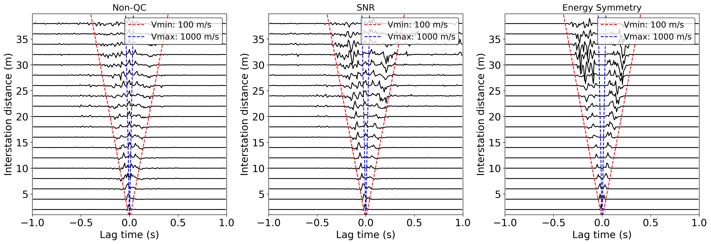
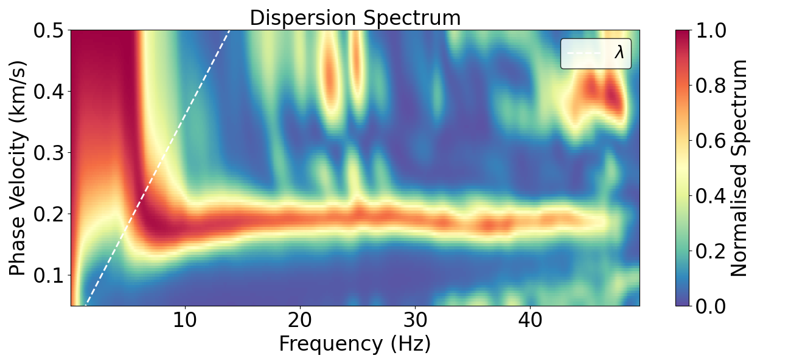

# noiseba - A Python Package for Seismic Ambient Noise Data Processing

<div align="left">

[](https://www.python.org/downloads/)
[](LICENSE)
[](https://github.com/VianWan/noiseba.git)


</div>


## 🔍 Overview

**noiseba** is a Python package designed for high-frequency seismic ambient noise surface wave imaging, including data preprocessing, cross-correlation, dispersion curve analysis, and vs [thickness] inversion.

## Installation

### From Source
```bash
git clone https://github.com/VianWan/noiseba.git
```

### Requirements
- Python 3.11+
- NumPy
- Matplotlib
- mkl_fft
- cc-fj

## Quick Start

### Cross-correlation

Compute cross-correlation functions efficiently:

```python
# Compute CCF
n_fft = 2 * win_len - 1
F = compute_fft(data_3D_taper, n_fft=n_fft)             # FFT
WF = whiten_spectrum(F, smooth_width=5, window='ones') # Whitening spectrum
idx, C = ccf(WF)                                       # CCF in frequency domain
ccf3 = ifft_real_shift(C, n_fft=n_fft)                 # CCF in time domain
ccf = stack_pws_numba(ccf3)                            # CCF stacking - no QC
```

### Extract Dispersion Curves

Extract dispersion curves using Park's method:

```python
# Extract dispersion curves using Park's method
_, *_ = park_from_dir(ccf_dir, 
              freq_min=0.1,  # Hz
              freq_max=45, 
              vel_min=50,    # m/s
              vel_max=500,  
              num_vel=101,   # number of velocity to scan
              part="left"    # CCF part: left (acausal) or right (causal)
              )
```

### Inversion

Vs inversion with regularization:

```python
# Define cost function with regularization
cost_function = CostFunction(
    curves=curves,
    nlayers=3,
    mode="global",
    lamb=1,            # Regularization weight (0 = no regularization)
    alpha_s=1e-1,      # Smoothness constraint on velocity values
    alpha_z=1e-2,      # First derivative constraint
    alpha_zz=0,        # Second derivative constraint
    alpha_h=1,         # Thickness constraint
    weights=[1, 1]     # Weights for different modes
)

# Define optimization parameters
optimizer = CDO
optimization_directives = {
    "population_size": 50,
    "max_iterations": 300,
    "c1": 2.1,              
    "c2": 2.1,              
    "njobs": 16,            # Number of parallel jobs
    "chi_factor": .5,       # Chi factor for convergence
    "model_norm": 1e-4,     # Model norm regularization
    "rng_seed": 42,         
}

# Create inversion object and run
inv = Inversion(cost_function, optimizer, optimization_directives)
inv.run()
```

## 📈 Examples

### CCF Segment Selection
<div align="center">
  
  <p><em>Cross-correlation function visualization</em></p>
</div>

### Dispersion Spectrum
<div align="center">
  
  <p><em>Dispersion spectrum analysis results</em></p>
</div>

## License

This project is licensed under the MIT License - see the [LICENSE](LICENSE) file for details.

## Contributing

Contributions are welcome! Please feel free to submit a Pull Request.

